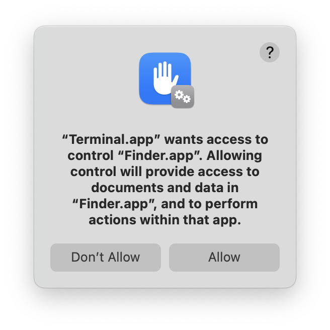

# security-automation-finder

## Finder Automation java example

This Java snippet uses the macOS osascript command to execute an AppleScript that interacts with Finder. 

Running this will trigger the Automation permission prompt if your tool isn’t already approved.

compile:
`javac FinderAutomation.java`

run:
`java FinderAutomation`

"“Terminal.app” wants access to control “Finder.app”. 
Allowing control will provide access to documents and data in “Finder.app”, and to perform actions within that app."

